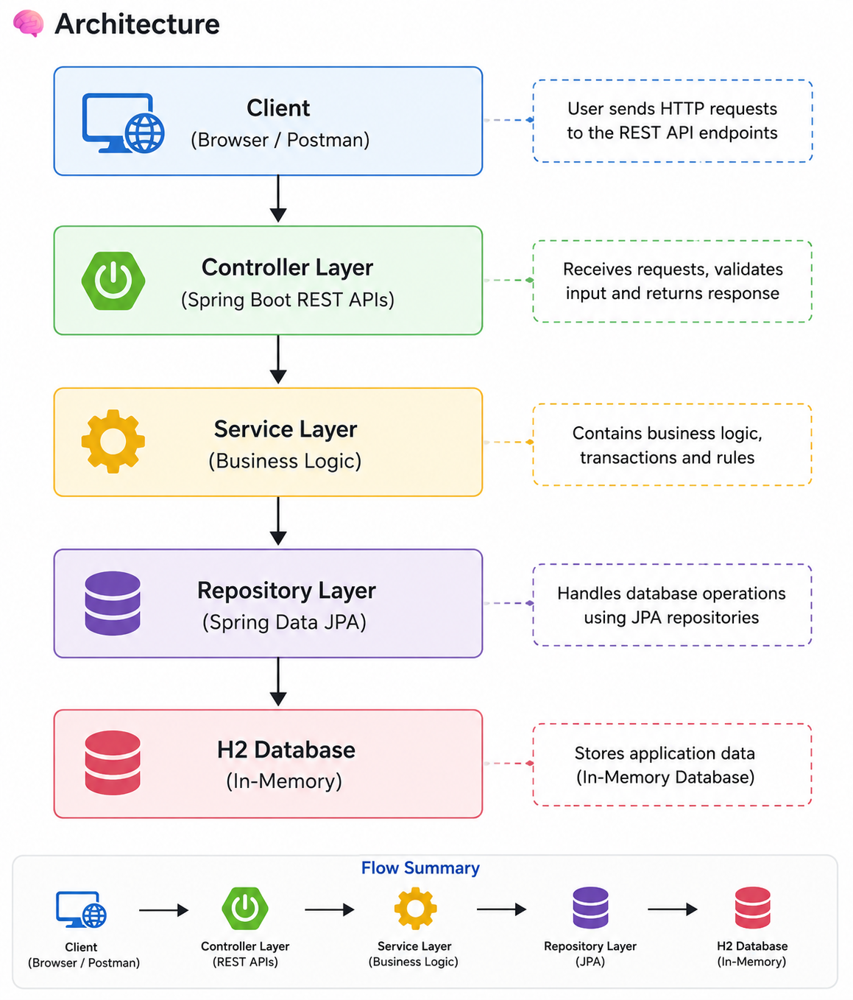

# User Service - Week 9 Final Project

## Overview
This project is a cloud-deployed backend application built using Spring Boot. It provides REST APIs for user management with authentication, caching, and clean architecture. The application is containerized using Docker and deployed on Render with CI/CD integration.

---

## Live Application
https://user-service-xxtq.onrender.com/users

---

## Tech Stack
- Java 17
- Spring Boot
- Spring Data JPA
- Spring Security (JWT)
- H2 Database (in-memory)
- Docker
- Render (Cloud Deployment)
- GitHub (CI/CD)
- JUnit & Mockito (Unit Testing)
- Spring Cache

---

## Features

### User APIs
- GET /users → Get all users
- GET /users/{id} → Get user by ID
- POST /users → Create user
- PUT /users/{id} → Update user
- DELETE /users/{id} → Delete user

### Authentication APIs
- POST /auth/register → Register user
- POST /auth/login → Login and receive JWT token

---

## Security
- JWT-based authentication implemented
- Protected endpoints using Spring Security
- Stateless session management

---

## Performance Optimization
- Optimized database queries using repository methods
- Implemented caching using Spring Cache
- Reduced repeated database calls for GET APIs

---

## Architecture

